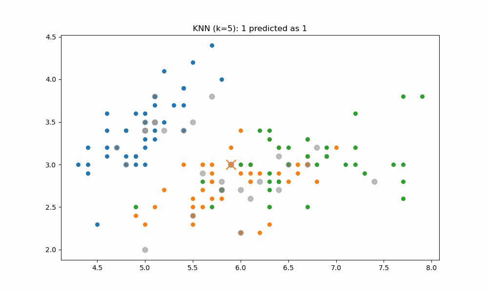
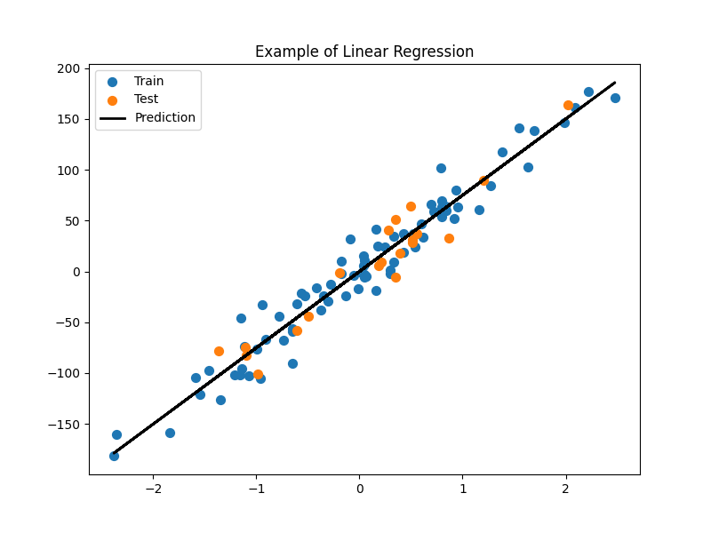
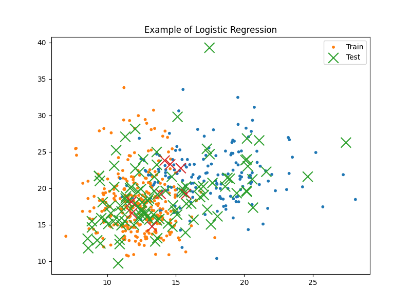
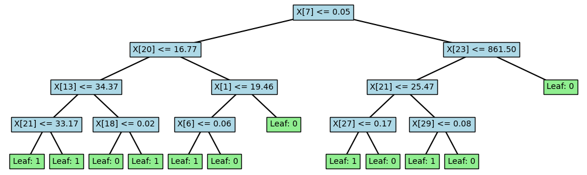

# ML From Scratch
## Table of contents
* [Introduction](#Introduction)
* [Supervised](#Supervised)
    * [KNN](#KNN)
    * [LinearRegression](#LinearRegression)
    * [LogisticRegression](#LogisticRegression)
    * [DecisionTree](#DecisionTree)

## Introduction
This repo is a collection of simple projects I tackled to familiarize myself with ML algorithms.

Most of these codes are insipred by [AssemblyAI videos](https://www.youtube.com/watch?v=p1hGz0w_OCo&list=PLcWfeUsAys2k_xub3mHks85sBHZvg24Jd&pp=iAQB).

## Supervised

### KNN
This is a simple [K Nearest Neighbours algorithm](https://en.wikipedia.org/wiki/K-nearest_neighbors_algorithm).
There are two scripts, both running on [sklearn iris dataset](https://scikit-learn.org/stable/auto_examples/datasets/plot_iris_dataset.html).

This implementation is quite basic, using the euclidean distance and no weights.

* KNN.py
    * Defines a `euclidean_distance(x1,x2)`
    * For each x evaluates distances from the training 
    * Sorts and assigns on Majority vote of the first `k`
* KNN_fancyAnimation.py
    * Same core functioning as KNN.py
    * Adds a silly animation of the decision process with `matplotlib.animation`
    

### LinearRegression
We assume a linear relation between variables and we try to [find this line](https://en.wikipedia.org/wiki/Linear_regression).

$$y = wx+b$$

$$
\chi^2 = \sum_{i=1}^{n} \frac{(y_i - (wx_i + b))^2}{n}
$$

where $y_i$ are the observed values, $x_i$ are the independent variables, and $n$ is the number of data points.

The Jacobian matrix $J$ for the derivatives with respect to $w$ and $b$ gives us how to change the parameters:

$$
J = \begin{bmatrix}
\frac{\partial \chi^2}{\partial w} \\
\frac{\partial \chi^2}{\partial b}
\end{bmatrix} = 
\begin{bmatrix}
\sum \frac{-2x_i(y_i - (wx_i + b))}{n}\\
\sum \frac{-2(y_i - (wx_i + b))}{n}
\end{bmatrix} = 
-\frac{2}{n}\begin{bmatrix}
\sum x_i(\hat{y} - y_i)\\
\sum (\hat{y} - y_i)
\end{bmatrix}
$$

The whole thing is done in a matrices form

* LinearRegression.py
    * Initialize *weight* $w$ and *bias* $b$ to zero
    * Repeat q.b. :
        * Predict the result
        * Evaluate the error
        * Gradient descent



### LogisticRegression
We want to decide, based on features, in which of two classes the tests are.

We take the linear regression and we convolute it with a **sigmoid**

The result is an output between 0 and 1 with a `fast' transition

Once we found the prediction for each test entry we just cut at 0.5
` class_pred = [0 if y<=0.5 else 1 for y in y_pred]`



### DecisionTree
The idea is to split the sample by **feature** at a certain **threshold**, to group similar elements from the sample.

To decide *how to spit* we need to find **how much information** we get for each possible **split**

The **Information gained** for a split is given by

$$
IG = E(parent)-[weighted\ average]*E(children)
$$

where we introduced the **Entropy** as a measure of disorder

$$
E = -\sum p(X)-log_2(p(X))\\
$$

Stopping criteria could be the maximum depth reached, a minimum of $\Delta E$ or a limit on the number of elements.

* DecisionTree.py (a bit caotic becaus of the helper functions)
    * Node class:
        * Initialization
        * Check if it is a leaf
    * DecisionTree class
        * Initialization
        * Fit calling helper functions:
            * Grow the tree
            * Where to split 
            * How much Information Gain
            * The actual split function
            * ...
        * Prediction
    * Two function to visualize the tree
        * `print_tree()` to have it on terminal
        * `plot_tree()` to have a matplotlib plot

This example is run on `data = datasets.load_breast_cancer()` with a max depth of 4 

```
.../ML_FromScratch$ python3 DecisionTree.py 
Decision Tree accuracy 0.9298245614035088

Tree structure:
Feature 7 <= 0.05102
|  Feature 20 <= 16.77
|  |  Feature 13 <= 34.37
|  |  |  Feature 21 <= 33.17
|  |  |  |  Leaf: 1
|  |  |  |  Leaf: 1
|  |  |  Feature 18 <= 0.02418
|  |  |  |  Leaf: 0
|  |  |  |  Leaf: 1
|  |  Feature 1 <= 19.46
...
```


### RandomForest
The idea is to split the dataset in random subsets.

Each subset is passed to a DecisionTree and we store the results.

When testing, we do a majority vote or we take the mean of the votes.